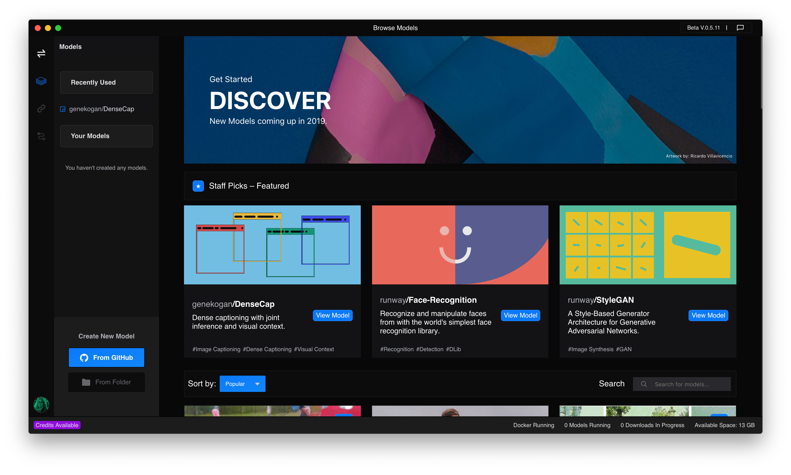

# Welcome to Runway!
> __Note__: Runway is beta software, so things are in flux! Expect features and documentation to change often.

Runway is a platform that allows creators of all kinds to use artificial intelligence in an intuitive way. In this documentation, we aim to help you get up and running with Runway.

#### System requirements

Runway supports Mac, Windows and Linux platforms.

### Getting Started

TODO

### Join our community

Runway has an active community of creators and contributors on Slack. You can join the community [here](https://join.slack.com/t/runwayml/shared_invite/enQtNTE2MDg0ODY2MTAzLTc4ZGVkMzE2MjljYzM3ZDRlNjkyMjk4NDZjOWU1ZTRjOTA3N2Y1ZjFiNTJkZTAyMWE0MGZiZjdlMTA1NTdiMzc). We encourage everyone to:

* Share your projects and creations
* Learn more about creative applications of machine learning
* Shape the future of Runway
* Form collaborations
* Get involved in attending and/or running workshops

If you want to contribute to the development of the project please visit our [GitHub account](https://github.com/runwayml) and read the [Contributing Guide](/#/how-to/contributing).

### Support

If you encounter any problems or issues with the installation, please check out the [Support Center](https://support.runwayml.com/).
