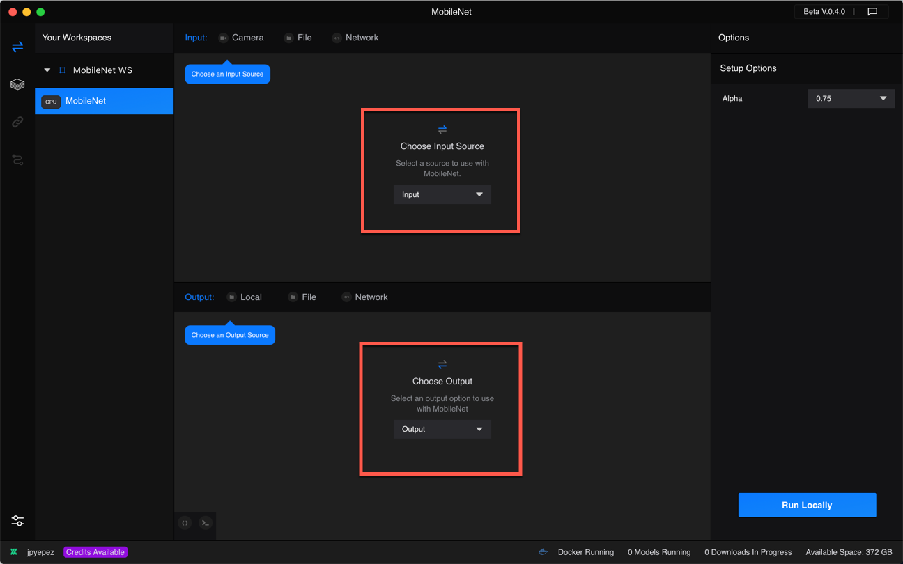

# Tutorial: Image Classification with MobileNet

Runway enables fast and simple image classification using lightweight
neural networks. This tutorial will show you how use the MobileNet
model to identify the objects in an image folder.

### Requirements
* Runway Beta
* Docker (If you don't have Docker installed, please follow the
  installation instructions [here](https://docs.runwayapp.ai/#/installation?id=download-docker))
* A folder with multiple image files

### Step 1

Select the **MobileNet** model from the Model Directory.

### Step 2

Add the model to a workspace using the drop-down list on the top right
side of the app.

### Step 3

Select **Input** > **File**, and click on **Open Folder** to select
your image folder.
Select **Output** > **Local**.

### Step 4

Click on the button on the bottom right side of the app to run the
model locally.

### Step 5

Click on each image to show the estimated label. Other **File** and
**Network** outputs allow you to export the labels and probabilities
for external use.

### Summary

This tutorial shows you how to perform image classification using
MobileNet models.