# Tutorial: Auto-titling the work of art that is your live webcam feed (im2txt with p5.js)

Runway makes it really simple to use AI with Javascript to create fun sketches on the web. This tutorial will guide you through generating live descriptions for your webcam feed using the im2txt model and p5.js.

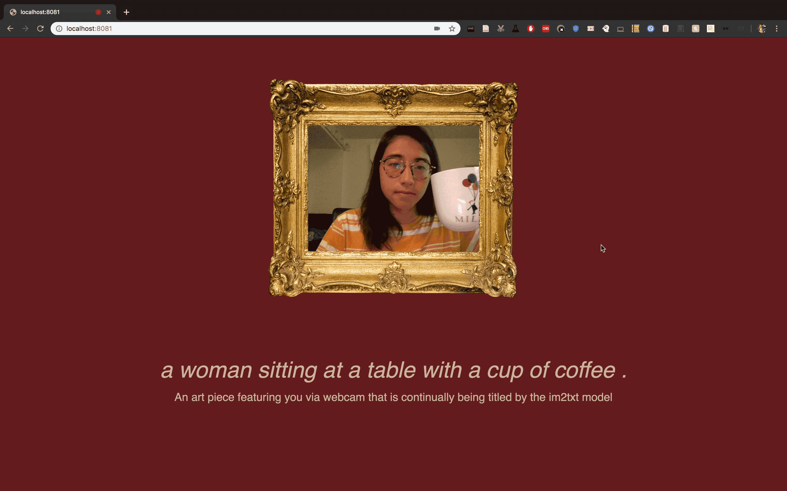

To get started, clone or download the example code from [this repository](https://github.com/runwayml/maya_challenge). This contains the p5 sketch we will be connecting with Runway.  

### Step 1

In this tutorial, we will use **im2txt**, which is based on the paper [Show and Tell: A Neural Image Caption Generator](https://arxiv.org/pdf/1411.4555.pdf) released by Google Research. **im2txt** is a deep neural network that learns how to describe the content of images. It is very useful for tasks such as captioning an image. 

The first step is selecting the im2txt model from the Model Directory.


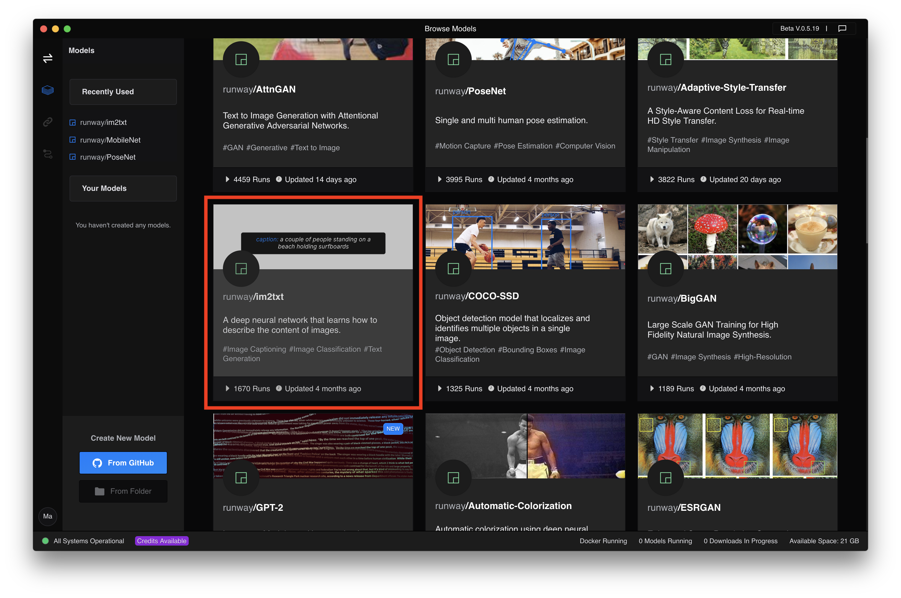

### Step 2

Once you have selected the model, you can view information about the model, including a description of what the model does, licensing information, as well as the model input and output datatypes (`image` for the input image and `array[text, number]` for a list of captions and probabilities for each generated caption). To use im2txt, you will first need to add the model to a workspace.

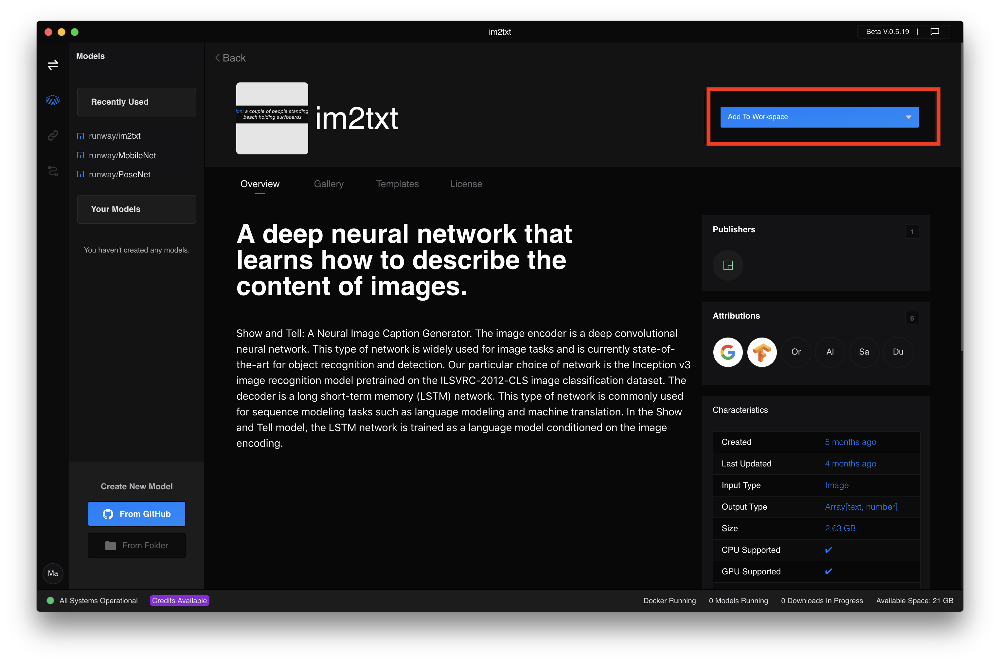

### Step 3

Once you have added the model to your workspace, select your input and output. In this case we will be using **Camera** as image input and **Preview** as our chosen output.

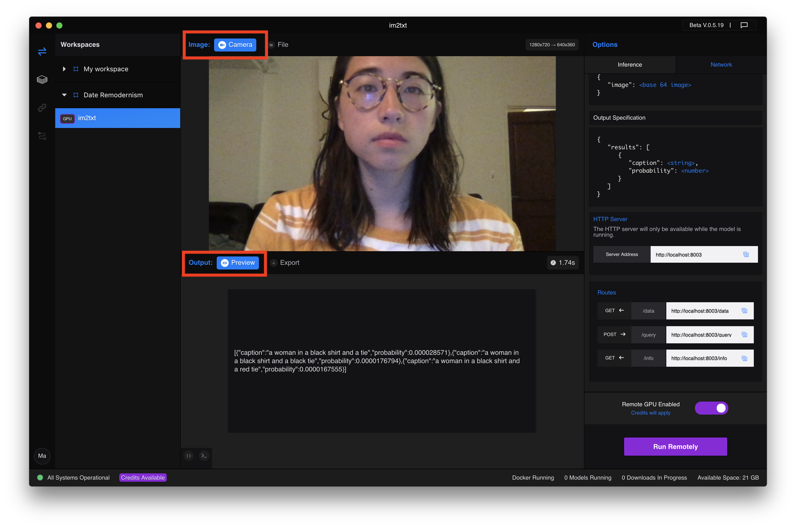

### Step 4

In this tutorial, we will be running **im2txt** remotely. Click "Run Remotely" to begin running the model. 

**Note: You need to have Docker installed in order to continue.**

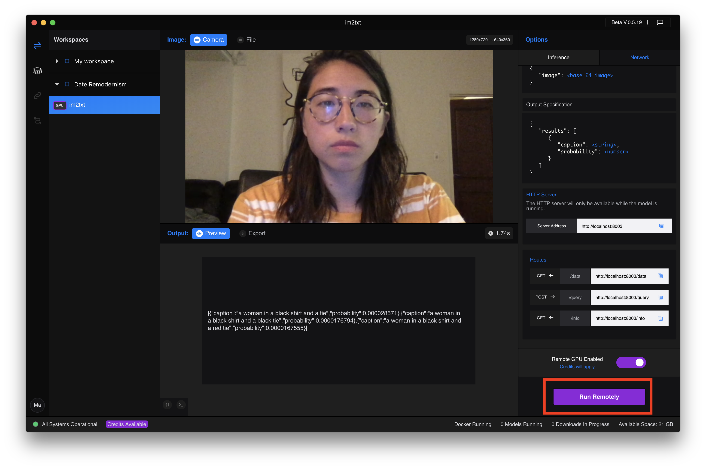

Now, you should see the output in the Preview section. Here, the model's first guess for the current camera feed is a woman in a black shirt and tie.

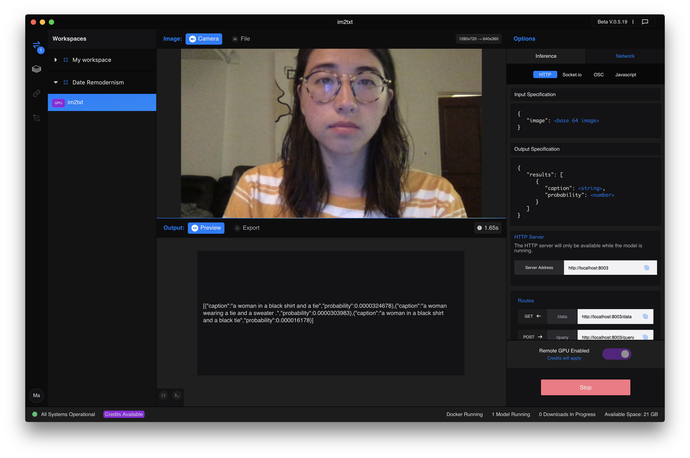

### Step 5

Now we're ready to connect Runway to our p5.js sketch. Runway will communicate with the p5 sketch via HTTP Post request. The sketch will send Runway an image from your webcam and then Runway will send back im2txt's best guess at what that image depicts.

To make this happen, we have to tell the sketch exactly where to make its post request. Navigate to **Network** in your workspace and make sure HTTP is selected.

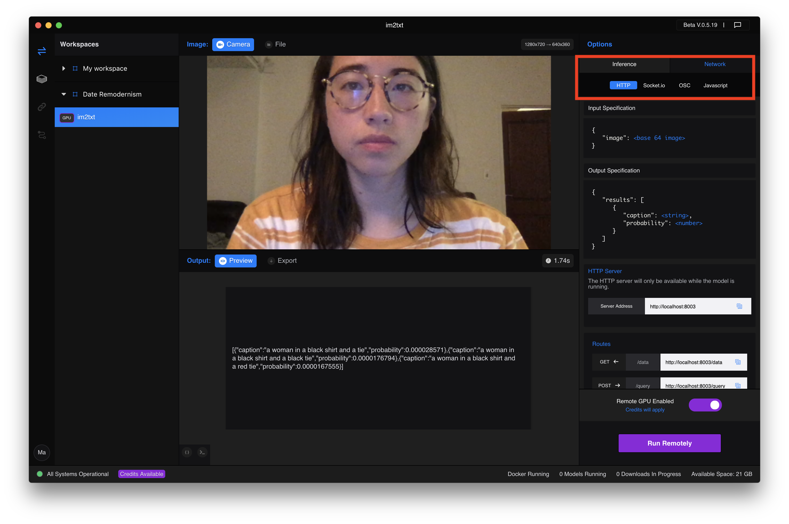

Then, look under the **Routes** heading at the **Post** label and copy the corresponding URL. This will be the URL that you will use in your sketch to communicate with Runway.
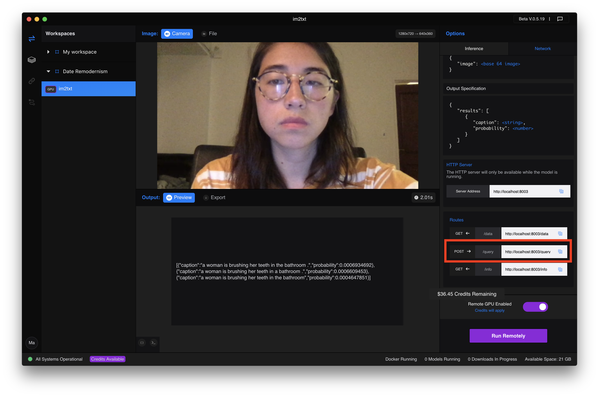

### Step 6

Now that we have the model up and running, it's time to connect it to our p5 sketch. Make sure you have downloaded or cloned the [repo](https://github.com/runwayml/maya_challenge), then open it up in your favorite text editor. 

In the sketch.js file, look and find where the url is defined, and replace that with the url you have just copied in the step above. For example, in this case, it became:

```javascript
const url = "http://localhost:8003/query";
```

This sketch continually makes an HTTP Post request to Runway, sending the image data from your webcam feed. This is all happening at the `httpPost` call in the `autotitle` function.

```javascript
httpPost(url, "json", postData, output => {
    if (output && output.results && output.results[0]) {
        // If there are results, update the caption
        newCaption = output.results[0].caption;

        // Call autotitle again
        autotitle();
    }
});
```

</p>

### Step 7

Run the sketch (you can find specific instructions on how to do this [here](https://developer.mozilla.org/en-US/docs/Learn/Common_questions/set_up_a_local_testing_server)) and navigate to it in your browser. Your browser will request access to your webcam, so make sure you click allow! Once you do, you should see a page that looks like this with yourself on the screen!

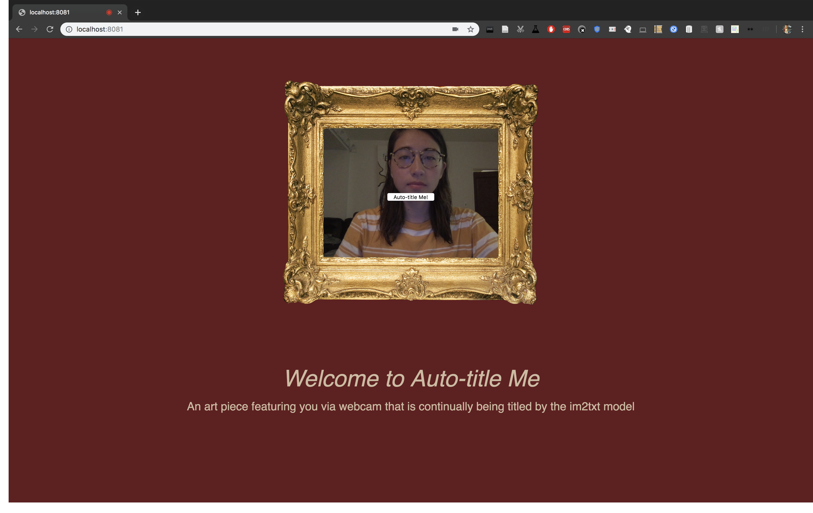

### Step 8

Once you make sure that your model is running in Runway (if it's stopped, restart it up), click **Auto-title Me!** to begin sending your webcam feed to im2txt in Runway! Your new title generated by im2txt will appear below your image.

Sometimes it gets it pretty right...

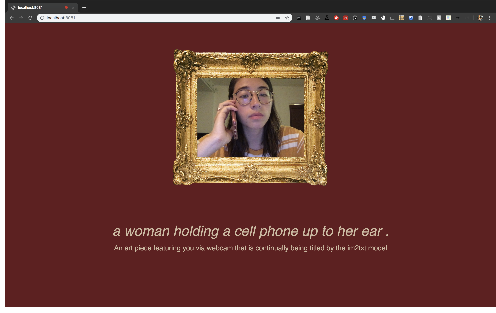

Buuuuut also sometimes it isn't quite there. It's still learning.


You can also always view the output of the model in the Preview section in Runway to see the complete JSON returned by im2txt.
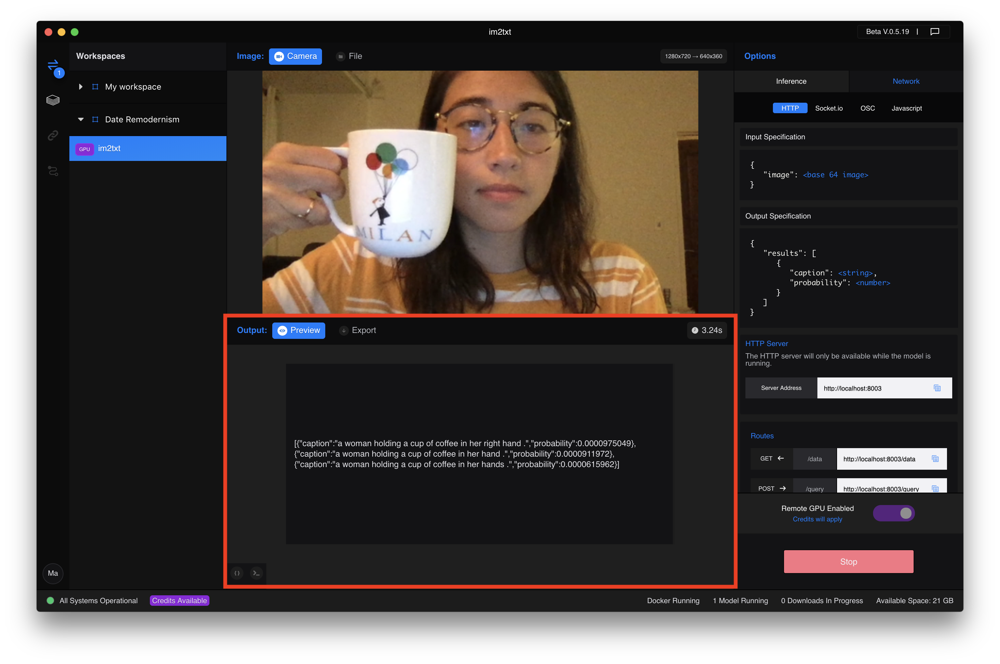

And that's it! Now feel free to go and remix this sketch or any other of the examples to create your own fun web experience using Runway.

### Summary

This tutorial shows how to use an image captioning model im2txt along with p5.js to generate labels for your live webcam feed in your browser. You can use the same approach for other predictive models inside Runway.
